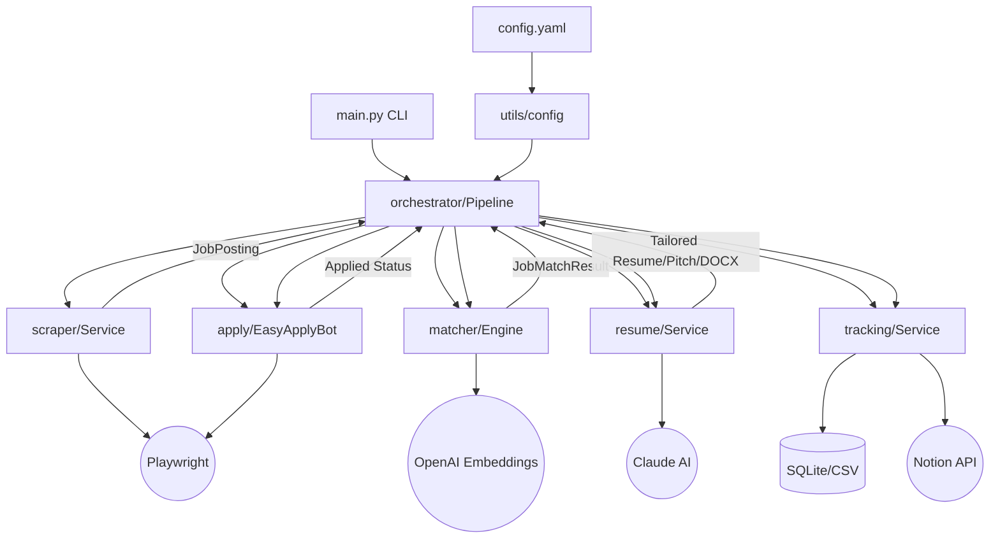
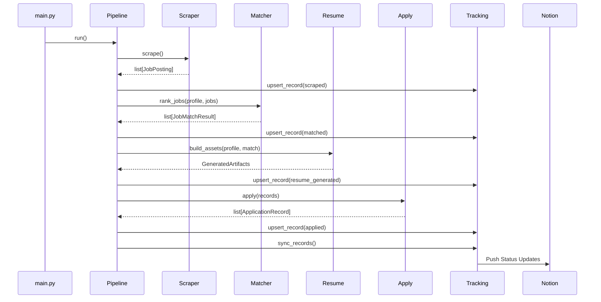

# ARCHITECTURAL ANALYSIS REPORT: Job Automation AI

This report provides a structural overview of the **Job Automation AI** project, mapping its internal dependencies, data flow, and key architectural components.

## 1. Project Overview
**Job Automation AI** is a modular Python-based system designed to automate the end-to-end job application lifecycle. It leverages LLMs (OpenAI for embeddings, Claude for content generation), browser automation (Playwright), and a structured tracking layer (SQLite/Notion).

## 2. System Architecture Graph

## 3. Component Breakdown

### Core Services
| Component | Responsibility | Key Dependencies |
| :--- | :--- | :--- |
| **Orchestrator** (`src/orchestrator`) | Manages the end-to-end pipeline execution from scraping to applying. | All services |
| **Scraper** (`src/scraper`) | Handles multi-source (LinkedIn, Naukri) job extraction. | Playwright |
| **Matcher** (`src/matcher`) | Ranks jobs using semantic similarity and skill overlap. | OpenAI API, NumPy/Cosine |
| **Resume** (`src/resume`) | Generates tailored resumes, cover letters, and pitches. | Claude API, python-docx |
| **Apply** (`src/apply`) | Automates the LinkedIn Easy Apply flow. | Playwright |
| **Tracking** (`src/tracking`) | Persists application states and syncs with Notion. | SQLite, Pandas, Notion Client |

### Data Models (`src/models.py`)
- **`CandidateProfile`**: The user's core data (experience, skills, projects).
- **`JobPosting`**: Raw data extracted by scapers.
- **`JobMatchResult`**: Scored and ranked job metadata.
- **`ApplicationRecord`**: The **Primary Data Entity** that tracks the entire lifecycle of a job through the system.

## 4. "God Nodes" Analysis
In this architecture, certain components act as central hubs with high connectivity.

### Node A: `JobApplicationPipeline` (The Orchestrator)
- **Centrality**: Extremely High.
- **Role**: It acts as the "brain" that initializes all services and pipes data between them.
- **Risk**: Changes here impact the entire system flow.

### Node B: `AppConfig` (The Config Hub)
- **Centrality**: High.
- **Role**: Every service depends on this node for parameters (API keys, selectors, thresholds).
- **Benefit**: Provides a single point of truth for system behavior.

### Node C: `ApplicationRecord` (The Entity Hub)
- **Centrality**: High (Data-level).
- **Role**: This model is passed between Matcher, Resume, and Apply services, accumulating state as it moves.
- **Benefit**: Decouples services by providing a standard interface for application data.

## 5. Sequence Diagram: Pipeline Execution

## 6. Conclusions & Suggestions
- **Modularity**: The system is highly modular, with clear service boundaries.
- **Resilience**: The use of fallback selectors in scraping indicates a design for high durability.
- **Scalability**: The multi-tenant-ready structure (profile isolation) suggests it could easily evolve into a multi-user service.
- **Suggestion**: Consider moving the Notion sync into an async background task to prevent blocking the main pipeline flow.

---
*Report generated by Antigravity (Graphify Analysis Engine).*
